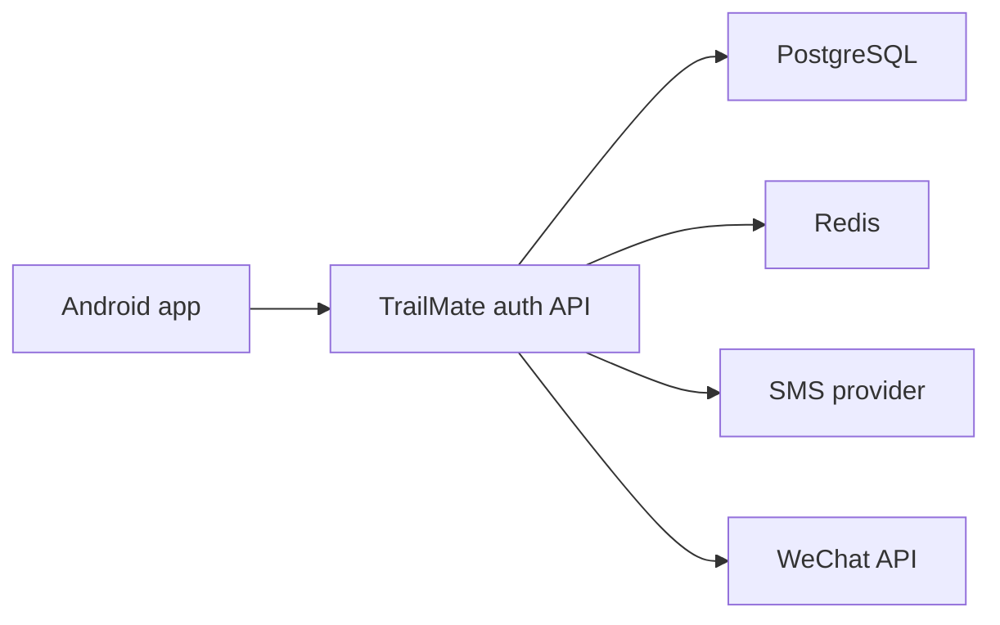
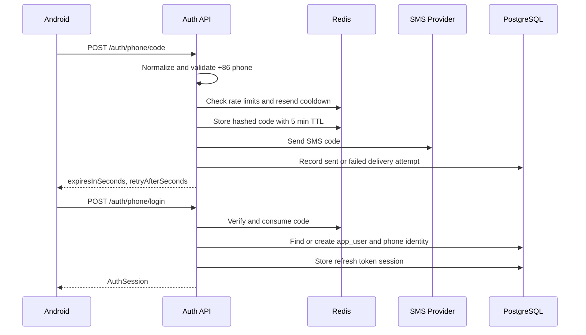
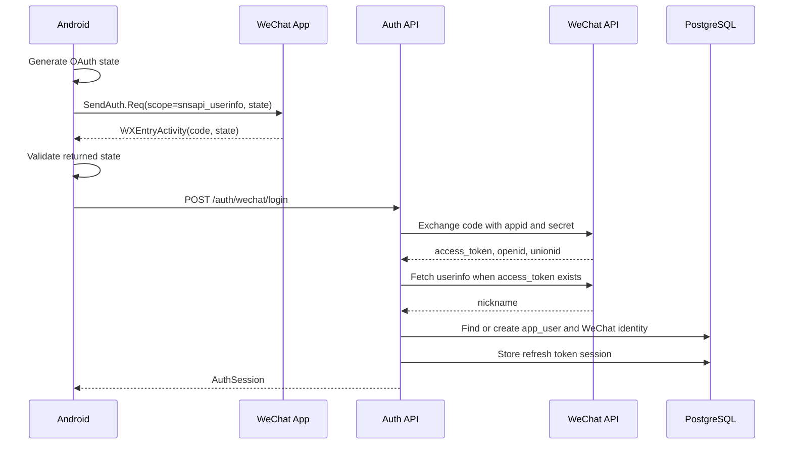

# TrailMate Auth Architecture

## Scope

TrailMate account auth must support:

1. Phone number login/register with SMS code.
2. WeChat login/register through the Android WeChat SDK.
3. A single account model that can later link both phone and WeChat identities.
4. Token refresh, logout, audit, and account deletion readiness.

The auth system should not carry route assessment, gear advice, GPX parsing, or social features. It only proves the user identity and issues TrailMate sessions.

## System Boundary



Android owns:

- Chinese login UI.
- Phone number normalization before sending requests.
- WeChat SDK launch, `state` generation, callback reception, and state validation before backend exchange.
- Local session persistence for the latest authenticated state.
- Local session lifecycle management: keep valid sessions, refresh near-expiry sessions, and clear only auth state when refresh is rejected or logout succeeds.

Server owns:

- Authoritative account creation and identity binding.
- SMS code generation, verification, and rate-limit decisions.
- WeChat `authCode` exchange with WeChat API.
- Access token and refresh token issuance.
- Refresh token rotation and logout revocation.
- Auth audit events.

## Runtime Components

| Component | Responsibility | Current State | Production Target |
| --- | --- | --- | --- |
| `AuthController` | HTTP contract for phone and WeChat auth | Implemented for phone code, phone login, WeChat login, refresh, and logout | Add current user |
| `AuthService` | Coordinates auth flows | Service supports phone, WeChat, refresh, and logout | Split into account, token, provider services |
| `SmsCodeSender` | Delivers login/register codes | `NoopSmsCodeSender` | Real provider adapter |
| `SmsCodeGenerator` | Generates login/register codes | Random by default; optional fixed code for internal smoke tests | Random or provider-owned generation |
| `SmsCodeRepository` | Stores short-lived code evidence | `InMemorySmsCodeRepository` by default, `RedisSmsCodeRepository` when configured | Redis-backed repository in deployed environments |
| `SmsCodeAttemptRecorder` | Records SMS delivery attempt evidence | No-op in memory mode, JDBC implementation records sent/failed delivery attempts | PostgreSQL-backed provider delivery ledger |
| `WechatAuthClient` | Exchanges Android auth code for WeChat identity | Preview and HTTP implementations | HTTP mode with configured AppID/AppSecret |
| `AuthAccountRepository` | Finds or creates unified TrailMate accounts for phone and WeChat identities | In-memory default plus tested JDBC implementation | PostgreSQL implementation over `app_user`, `user_phone_identity`, and `user_wechat_identity` enabled by datasource/profile config |
| `AuthSessionIssuer` | Issues, rotates, and revokes access/refresh token pairs after identity proof succeeds | Random in-memory default plus tested JDBC implementation | JWT access token plus stored refresh token family enabled by datasource/profile config |
| `AuthAuditRecorder` | Records auth security events | No-op in memory mode, JDBC implementation records code request, phone login, and WeChat login events | Expand to refresh, logout, replay, account deletion, and provider delivery failure events |

## Phone Login/Register Flow



Rules:

- Phone is stored in E.164 format such as `+8613800138000`.
- Code is never stored as plain text in production. The Redis repository stores a SHA-256 digest.
- JDBC mode stores SMS delivery evidence in `auth_sms_code_attempt`, including `sent` and `failed` status, provider name, expiry, and hashed client address.
- A fixed SMS code can be configured only for internal smoke tests before a real provider exists; it must stay blank in production.
- Login/register is one endpoint because the user-facing flow is the same.
- Verification must consume the code once, successful or not after max retry policy is reached.
- Public beta must include per-phone and per-IP throttles; per-device throttles can be added when stable device identity is available.

## WeChat Login/Register Flow



Rules:

- Android must reject callbacks where returned `state` does not match the pending request.
- Server must treat WeChat `authCode` as single-use and must not cache it.
- `openid` is unique per WeChat app. `unionid` may be absent until the WeChat platform provides it.
- HTTP mode maps WeChat `nickname` to the TrailMate session `displayName`; if userinfo is unavailable, the service uses the default `微信用户`.
- Account identity key should be `(app_id, open_id)` first, then `union_id` for cross-app linking when present.
- If a signed-in user later binds WeChat, the service should link `user_wechat_identity` to the existing `app_user` instead of creating a duplicate account.

## Token Model

Use two tokens:

- Access token: short-lived JWT, 15-30 minutes, signed by server.
- Refresh token: opaque random token, 30-90 days, stored hashed in PostgreSQL.

Refresh rules:

- Rotate refresh token on every refresh.
- Store token family id to detect replay.
- Revoke all sessions for a user on passwordless identity risk events, account deletion, or explicit "logout all".
- Android stores the latest tokens locally, refreshes close-to-expiry sessions before protected calls, and clears only auth state on normal logout.
- The current local server preview already exposes `/auth/refresh` and `/auth/logout`; production must move refresh state from memory into `auth_refresh_token`.

## Redis Evaluation

Redis is recommended for production, but not as the source of truth.

| Use Case | Need Redis? | Reason |
| --- | --- | --- |
| SMS code TTL | Yes for public beta | Codes expire quickly and need atomic consume semantics |
| SMS resend cooldown | Yes | `SET NX EX` style keys prevent duplicate sends across server nodes |
| SMS request limit | Yes | Per-phone/IP counters need fast expiry windows |
| WeChat `state` | No for current Android flow | Android validates state locally before backend exchange |
| Refresh token storage | No | Durable revocation and audit belong in PostgreSQL |
| Access token blacklist | Optional | Needed only if JWT lifetime is long or immediate revocation is required |
| Distributed locks | Later | Useful for GPX import jobs, not first auth milestone |
| Cache user profile | Later | Optimize after database access patterns are measured |

Recommendation:

- Local development: no Redis required.
- First internal test: Redis optional; in-memory repository is acceptable for single-node preview.
- Docker Compose and production-like deployments: use Redis for SMS code TTL, one-time consumption, resend cooldown, and per-phone/IP request counters.
- Public beta should add provider-specific delivery failure handling before enabling public phone login.
- Do not store account identity, refresh tokens, consent records, or audit events only in Redis.

Auth persistence runtime switch:

```yaml
trailmate:
  auth:
    persistence:
      mode: memory # memory | jdbc
    sms-code-store:
      mode: memory # memory | redis
    sms-code:
      fixed-code: "" # internal smoke tests only
```

`memory` is the default for local Android/backend UI development. `jdbc` enables `JdbcAuthAccountRepository`, `JdbcAuthSessionIssuer`, `JdbcAuthAuditRecorder`, and `JdbcSmsCodeAttemptRecorder`, and requires a configured PostgreSQL datasource plus the auth schema migration. `sms-code-store.mode=redis` enables `RedisSmsCodeRepository`, Redis-backed resend cooldown, and Redis-backed request rate limiting, and requires a configured Redis connection.

Suggested Redis keys:

```text
auth:sms:code:{phone_hash} -> code_hash, ttl 300s
auth:sms:cooldown:{phone_hash} -> 1, ttl 60s
auth:rate:phone:{phone_hash} -> count, ttl 1h
auth:rate:ip:{ip_hash} -> count, ttl 1h
auth:token:blacklist:{jti} -> 1, ttl until access token expiry
```

## Middleware Decisions

| Middleware | Decision | Timing |
| --- | --- | --- |
| PostgreSQL | Required | First backend milestone |
| Redis | Required for deployed phone-code storage and request counters | Enabled in Docker Compose now |
| Object storage | Required for GPX files | File-import milestone |
| Message queue | Not required for auth | Consider for GPX parse and AI jobs |
| API gateway | Not required initially | Add when deploying multiple services |
| Secret manager | Required outside local dev | Before storing WeChat/SMS secrets in production |

## Security Controls

- Hash refresh tokens before storing.
- Hash SMS codes and phone/IP rate-limit identifiers.
- Never log SMS code, refresh token, WeChat `authCode`, or WeChat secret.
- Use account status checks before issuing any new session.
- JDBC mode records auth audit events for code request, phone login, and WeChat login.
- JDBC mode records SMS delivery attempts in `auth_sms_code_attempt` without storing the plain code.
- Add audit events for refresh, logout, token replay, and account deletion before public beta.
- Use database unique constraints to prevent duplicate phone or WeChat identities.
- Treat phone and WeChat login as account creation only after the external identity proof succeeds.

## Implementation Order

1. Keep current Android phone and WeChat UI.
2. Finish WeChat Open Platform real-device loop with AppID, package name, and SHA1.
3. Add PostgreSQL-backed account and identity repositories.
4. Add refresh token table and token rotation.
5. Add real SMS provider adapter and map provider-specific delivery failure codes.
6. Add remaining audit events.
7. Add `/users/me`.
8. Add account linking UI later, after the basic sign-in path is stable.
