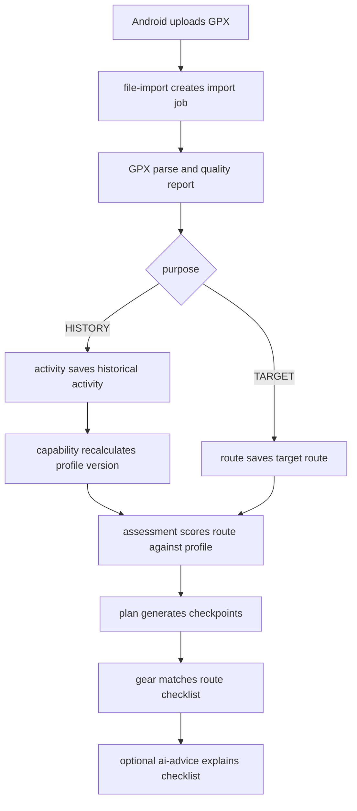

# TrailMate Server Architecture

## Purpose

TrailMate uses a C/S architecture.

The Android app owns field interaction: Chinese mobile UI, onboarding capture, GPX file picking, local fallback analysis, MapLibre/PMTiles and optional AMap rendering, GPS calibration, foreground track recording, offline route packs, offline base-map proof, and last-known cached views.

The server owns durable and reproducible data: account identity, uploaded GPX assets, parsed history activities, capability profile versions, target routes, route assessments, hike plans, equipment checklist artifacts, PMTiles catalog metadata, completion feedback, data export, deletion, and audit evidence.

## Product Boundary

Server-side logic should support the app's current user flow:

1. Register or sign in with phone SMS code or WeChat.
2. Save basic profile and outdoor baseline.
3. Import history GPX files.
4. Generate a capability profile from usable history.
5. Import a target route GPX.
6. Generate deterministic route assessment and plan.
7. Ask optional AI for equipment explanation/checklist text.
8. Save personal gear and match gear to the current route.
9. Submit hike completion feedback and optional recorded track.
10. Export or delete user data.

The server must not become a social network, marketplace, rescue service, realtime tracking platform, or turn-by-turn navigation engine.

## Module Map

| Module | Owns | Does Not Own |
| --- | --- | --- |
| `auth` | Phone SMS code login/register, WeChat authorization-code login/register, token refresh, logout, account deletion authorization | GPX parsing or route scoring |
| `user-profile` | Onboarding profile, height/weight, outdoor baseline, privacy consent timestamps | Raw GPX file storage |
| `file-import` | Multipart GPX upload, async import jobs, XML safety checks, quality reports, source file metadata | Capability profile generation |
| `activity` | Historical activity records, normalized track summaries, activity deletion | Target route risk scoring |
| `capability` | Capability profile versions, evidence snapshots, deterministic recalculation | Rewriting historical assessments |
| `route` | Target route records, route geometry summaries, target city/region metadata | Personal suitability decisions |
| `assessment` | Match score, match level, confidence, duration range, risk evidence | Medical, rescue, or realtime safety claims |
| `plan` | Timing, rest, supply, risk, and rollback checkpoints | Live turn-by-turn navigation |
| `gear` | User gear inventory, availability, route checklist artifact | Shopping, ads, or marketplace |
| `ai-advice` | Optional LLM explanation and equipment wording based on frozen deterministic facts | Changing route score, distance, ascent, confidence, risks, or plan facts |
| `track` | Completed track upload, recording summary, association with a plan | Realtime rescue tracking |
| `data-control` | Account export, account deletion, tombstone/audit records | Hidden retention outside policy |

## Ownership Split

| Capability | Android | Server |
| --- | --- | --- |
| Onboarding form | Capture and cache locally | Persist profile and consent evidence |
| Historical GPX import | File picker and local queue | Parse, validate, normalize, persist |
| Local sample/demo route | Yes | No |
| Capability profile | Show cached result and local fallback | Authoritative versioned profile |
| Target route assessment | Local fallback until server is ready | Authoritative deterministic assessment |
| AI equipment advice | Validate and display, fallback locally | Optional AI orchestration with guardrails |
| MapLibre/PMTiles rendering and optional AMap maps | Yes | Serve PMTiles catalog metadata only; no navigation engine |
| GPS and track recording | Yes | Store completed track summaries after upload |
| Offline base-map proof | Capture per device/route | Store optional evidence summary only |
| Export/delete | Request and show status | Execute and audit |

## Deterministic Core

Route score, match level, confidence, estimated duration range, risk facts, and plan checkpoints must be deterministic. AI can only transform already computed facts into natural language or equipment checklist suggestions. The server response must carry:

- `algorithmVersion`
- `assessmentFingerprint`
- `profileVersion`
- source `routeId`
- evidence facts used for the result

Android must reject stale AI or plan responses whose fingerprint does not match the current route assessment.

## Data Model Groups

The first server schema should be grouped around these aggregates:

| Aggregate | Key Records |
| --- | --- |
| Account | `app_user`, phone identity, WeChat identity, auth tokens, consent records |
| File import | `file_asset`, `import_job`, quality report JSON |
| Historical activity | `hike_activity`, summarized track points, derived segments |
| Capability | `capability_profile`, evidence JSON, algorithm version |
| Target route | `target_route`, route points/segments, terrain tags |
| Assessment | `route_assessment`, risk factors, evidence |
| Plan | `hike_plan`, `plan_checkpoint` |
| Gear | `gear_item`, `route_gear_checklist` |
| Feedback | `completion_feedback`, optional `recorded_track` |
| Data control | export job, deletion job, audit/tombstone records |

## Auth Provider Boundary

The first server module includes provider interfaces so phone and WeChat auth can move from local preview to production without changing Android or controllers:

- `SmsCodeSender`: sends login/register verification codes.
- `SmsCodeRepository`: stores short-lived codes and consumes them after successful login.
- `SmsCodeAttemptRecorder`: records sent/failed SMS delivery evidence without storing the code.
- `WechatAuthClient`: exchanges a WeChat mobile authorization code for a stable WeChat identity.

Local development uses `NoopSmsCodeSender`, `InMemorySmsCodeRepository`, `InMemorySmsCodeCooldownRepository`, `InMemorySmsCodeRateLimiter`, `NoopSmsCodeAttemptRecorder`, and `PreviewWechatAuthClient`. Docker Compose uses PostgreSQL plus Redis-backed code storage, resend cooldown, per-phone/IP request counters, and JDBC auth audit/delivery-attempt recording. Public beta must replace the SMS sender with a real provider and run the WeChat Open Platform client with the Android app's WeChat credentials.

Detailed auth architecture, Redis evaluation, and account table design live in:

- [TrailMate Auth Architecture](./trailmate-auth-architecture.md)
- [TrailMate Auth Database Schema](../database/trailmate-auth-schema.md)

Runtime configuration:

- `trailmate.auth.wechat.mode=preview|http`
- `trailmate.auth.persistence.mode=memory|jdbc`
- `trailmate.auth.wechat.app-id`
- `trailmate.auth.wechat.app-secret`
- `trailmate.auth.sms-code-store.mode=memory|redis`
- `trailmate.auth.sms-code.fixed-code` for internal smoke tests only; leave blank in production
- `trailmate.auth.wechat.api-base-url`

Android runtime configuration:

- `TRAILMATE_SERVER_BASE_URL` controls whether onboarding auth uses the local preview actions or `TrailMateHttpAuthApiClient`.
- Empty value keeps local preview for UI development.
- Non-empty value routes phone and WeChat auth actions to the configured backend base URL.
- `TRAILMATE_WECHAT_APP_ID` enables Android WeChat SDK launch and callback handling through `WXEntryActivity`.
- Android stores the pending WeChat OAuth `state` for each launched auth request and rejects mismatched callbacks before sending an auth code to the backend.

## Processing Flow

## Android API Boundary

Android should call a single `TrailMateBackendApi` port. Concrete Retrofit/OkHttp code can be added later behind that port. This keeps current Compose screens and local rules testable while the server is being built.

The port groups operations by product intent instead of low-level HTTP details:

- auth/session
- profile sync
- GPX import
- activities and capability profile
- routes, assessments, and plans
- gear advice
- feedback and completed tracks
- export and deletion

## Failure Policy

Network failure must not block field use. Android should:

- keep the latest saved route, plan, and gear checklist visible;
- keep GPS recording local while offline;
- queue uploads where possible;
- show conservative fallback copy for failed AI advice;
- never claim remote sync, export, deletion, or AI success without a server acknowledgement.

## First Server Milestone

The first backend milestone should implement:

1. Phone SMS auth, WeChat auth, token refresh, logout, and current user.
2. Profile save/read.
3. GPX import job API.
4. History activity list.
5. Capability profile current version.
6. Target route import/read.
7. Assessment generation/read.
8. Plan generation/read.
9. Gear inventory and route checklist.
10. Data export/delete request stubs with audit records.

Track upload, AI advice, and richer feedback can follow after the deterministic assessment and plan loop is stable.
