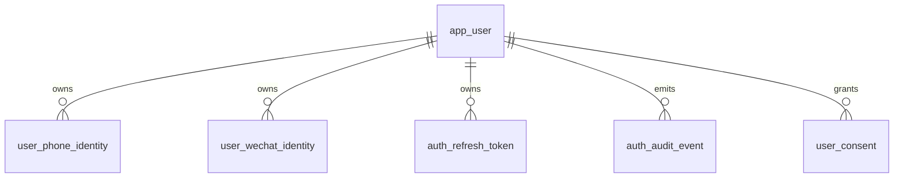

# TrailMate Auth Database Schema

## Database Choice

Use PostgreSQL as the source of truth for users, identities, sessions, consent, and audit records. Use Redis only for short-lived SMS codes, cooldowns, and rate limits.

The initial SQL migration lives at `trailmate-server/src/main/resources/db/migration/V1__create_auth_schema.sql` and is used by JDBC/Flyway-backed auth deployments.

Primary key convention:

- Use text application ids so the service can use `usr_...`, UUID strings, or future ULID strings without changing Android contracts.
- Store timestamps as `timestamptz`.
- Use `deleted_at` for account-level soft deletion where audit and export rules require traceability.
- Use lowercase enum-like `text` values with `CHECK` constraints in the first milestone; move to database enums only after values stabilize.

## Entity Relationship



Current server code uses `AuthAccountRepository` as the persistence port for account creation. `InMemoryAuthAccountRepository` is only a local preview implementation. The production repository should map:

- `findOrCreateByPhone` to `app_user` plus `user_phone_identity`.
- `findOrCreateByWechat` to `app_user` plus `user_wechat_identity`.
- future account linking to the same identity tables without changing Android or controller contracts.

Current server code uses `AuthSessionIssuer` as the session issuing port. `RandomAuthSessionIssuer` is only a local preview implementation. `JdbcAuthSessionIssuer` inserts, rotates, and revokes `auth_refresh_token` rows while returning a short-lived access token to Android.

## Tables

### `app_user`

Authoritative TrailMate account record.

```sql
create table app_user (
    id text primary key,
    status text not null default 'active'
        check (status in ('active', 'disabled', 'deleted')),
    display_name text,
    avatar_url text,
    locale text not null default 'zh-CN',
    timezone text not null default 'Asia/Shanghai',
    onboarding_status text not null default 'account_created'
        check (onboarding_status in ('account_created', 'profile_completed', 'ready')),
    created_at timestamptz not null default now(),
    updated_at timestamptz not null default now(),
    disabled_at timestamptz,
    deleted_at timestamptz
);

create index idx_app_user_status on app_user(status);
```

Notes:

- `status='deleted'` prevents login but preserves tombstone and audit linkage.
- `display_name` can come from WeChat nickname, phone fallback, or later profile editing.

### `user_phone_identity`

Verified phone login identity.

```sql
create table user_phone_identity (
    id text primary key,
    user_id text not null references app_user(id),
    phone_e164 text not null,
    phone_country_code text not null default '+86',
    verified_at timestamptz not null,
    last_login_at timestamptz,
    created_at timestamptz not null default now(),
    updated_at timestamptz not null default now(),
    revoked_at timestamptz,
    constraint uq_user_phone_identity_phone unique (phone_e164),
    constraint chk_user_phone_identity_phone_format check (phone_e164 ~ '^\\+861[0-9]{10}$')
);

create index idx_user_phone_identity_user on user_phone_identity(user_id);
```

Notes:

- One phone number can belong to only one active TrailMate account.
- If phone rebind is needed, create a new row and set `revoked_at` on the old row only after a product-reviewed recovery flow exists.

### `user_wechat_identity`

Verified WeChat identity for Android app login.

```sql
create table user_wechat_identity (
    id text primary key,
    user_id text not null references app_user(id),
    app_id text not null,
    open_id text not null,
    union_id text,
    nickname text,
    avatar_url text,
    scope text,
    verified_at timestamptz not null,
    last_login_at timestamptz,
    created_at timestamptz not null default now(),
    updated_at timestamptz not null default now(),
    revoked_at timestamptz,
    constraint uq_user_wechat_identity_openid unique (app_id, open_id)
);

create unique index uq_user_wechat_identity_unionid
    on user_wechat_identity(union_id)
    where union_id is not null and revoked_at is null;

create index idx_user_wechat_identity_user on user_wechat_identity(user_id);
```

Notes:

- `(app_id, open_id)` is the login key for the current mobile app.
- `union_id` is optional and should be used for cross-app account merge only when WeChat returns it.
- Never store WeChat access token unless TrailMate needs follow-up WeChat API calls; current login flow does not.

### `auth_refresh_token`

Opaque refresh token store. Access tokens are JWTs and are not stored by default.

```sql
create table auth_refresh_token (
    id text primary key,
    user_id text not null references app_user(id),
    provider text not null
        check (provider in ('phone', 'wechat')),
    token_hash text not null,
    token_family_id text not null,
    previous_token_id text references auth_refresh_token(id),
    device_id text,
    device_name text,
    platform text not null default 'android'
        check (platform in ('android', 'web', 'server_test')),
    issued_at timestamptz not null default now(),
    expires_at timestamptz not null,
    rotated_at timestamptz,
    revoked_at timestamptz,
    revoke_reason text,
    last_used_at timestamptz,
    last_used_ip_hash text,
    user_agent_hash text,
    constraint uq_auth_refresh_token_hash unique (token_hash)
);

create index idx_auth_refresh_token_user_active
    on auth_refresh_token(user_id, expires_at)
    where revoked_at is null;

create index idx_auth_refresh_token_family
    on auth_refresh_token(token_family_id);
```

Notes:

- Store only a strong hash of the refresh token.
- On refresh, insert a new token row, set old row `rotated_at`, and link `previous_token_id`.
- If a rotated token is used again, revoke the full `token_family_id`.

### `auth_sms_code_attempt`

Durable delivery attempt ledger for SMS code requests. The actual active code lives in Redis in deployed environments and can use memory in local preview mode.

```sql
create table auth_sms_code_attempt (
    id text primary key,
    phone_e164 text not null,
    scene text not null default 'login_or_register'
        check (scene in ('login_or_register')),
    provider text not null default 'noop',
    delivery_status text not null
        check (delivery_status in ('created', 'sent', 'failed')),
    failure_code text,
    failure_message text,
    request_ip_hash text,
    device_id text,
    created_at timestamptz not null default now(),
    expires_at timestamptz not null
);

create index idx_auth_sms_code_attempt_phone_created
    on auth_sms_code_attempt(phone_e164, created_at desc);
```

Notes:

- Do not store the plain SMS code here.
- JDBC mode records `sent` and `failed` attempts through `SmsCodeAttemptRecorder`.
- The current sender provider is `noop` until a real SMS adapter is configured.
- `request_ip_hash` stores a one-way hash of the client address for debugging and abuse correlation.
- In production, Redis stores the active code hash and request counters; this table records delivery evidence and debugging metadata.

### `user_consent`

Tracks privacy and service consent evidence needed for map SDK and account data processing.

```sql
create table user_consent (
    id text primary key,
    user_id text not null references app_user(id),
    consent_type text not null
        check (consent_type in ('privacy_policy', 'terms', 'amap_privacy', 'data_processing')),
    consent_version text not null,
    accepted_at timestamptz not null,
    revoked_at timestamptz,
    source text not null default 'android_onboarding',
    created_at timestamptz not null default now()
);

create unique index uq_user_consent_active
    on user_consent(user_id, consent_type, consent_version)
    where revoked_at is null;
```

Notes:

- Keep AMap privacy consent separate from TrailMate account consent.
- If policy versions change, insert a new consent row instead of mutating historical evidence.

### `auth_audit_event`

Append-only security event ledger.

```sql
create table auth_audit_event (
    id text primary key,
    user_id text references app_user(id),
    event_type text not null
        check (event_type in (
            'sms_code_requested',
            'phone_login_succeeded',
            'phone_login_failed',
            'wechat_login_succeeded',
            'wechat_login_failed',
            'token_refreshed',
            'logout',
            'refresh_token_replay',
            'account_disabled',
            'account_deleted'
        )),
    provider text
        check (provider is null or provider in ('phone', 'wechat')),
    outcome text not null
        check (outcome in ('success', 'failure')),
    reason_code text,
    phone_e164_hash text,
    wechat_open_id_hash text,
    ip_hash text,
    device_id text,
    user_agent_hash text,
    metadata_json jsonb not null default '{}'::jsonb,
    created_at timestamptz not null default now()
);

create index idx_auth_audit_event_user_created
    on auth_audit_event(user_id, created_at desc);

create index idx_auth_audit_event_type_created
    on auth_audit_event(event_type, created_at desc);
```

Notes:

- Audit events should not store raw phone numbers, SMS codes, refresh tokens, or WeChat auth codes.
- Use hashes for identifiers that are useful for security correlation but should not be exposed.
- The current JDBC auth runtime writes `sms_code_requested`, `phone_login_succeeded`, `phone_login_failed`, and `wechat_login_succeeded`/`wechat_login_failed`.

## Redis Key Design

Redis records are operational state, not durable account data.

```text
auth:sms:code:{phone_hash}
  value: { code_hash, scene, created_at, expires_at, attempt_count }
  ttl: 300 seconds

auth:sms:cooldown:{phone_hash}
  value: 1
  ttl: 60 seconds

auth:rate:phone:{phone_hash}
  value: integer
  ttl: 1 hour

auth:rate:ip:{ip_hash}
  value: integer
  ttl: 1 hour

auth:token:blacklist:{jti}
  value: 1
  ttl: access token remaining lifetime
```

Atomic operations required:

- Request code: check cooldown and rate keys, set code key, set cooldown key.
- Verify code: compare hash and delete code key atomically.
- Rate limiting: increment and expire in one operation or Lua script.

## Account Creation Transactions

Phone login transaction:

1. Verify SMS code in Redis.
2. Begin PostgreSQL transaction.
3. Find `user_phone_identity` by `phone_e164`.
4. If missing, insert `app_user` and `user_phone_identity`.
5. If found, check `app_user.status='active'`.
6. Insert `auth_refresh_token`.
7. Insert `auth_audit_event`.
8. Commit and return session.

WeChat login transaction:

1. Exchange `authCode` with WeChat API.
2. Begin PostgreSQL transaction.
3. Find `user_wechat_identity` by `(app_id, open_id)`.
4. If missing and `union_id` exists, optionally find existing identity by `union_id`.
5. If still missing, insert `app_user` and `user_wechat_identity`.
6. If found, check `app_user.status='active'` and update `last_login_at`.
7. Insert `auth_refresh_token`.
8. Insert `auth_audit_event`.
9. Commit and return session.

## First Migration Order

1. `app_user`
2. `user_phone_identity`
3. `user_wechat_identity`
4. `auth_refresh_token`
5. `auth_sms_code_attempt`
6. `user_consent`
7. `auth_audit_event`

This order lets the service migrate from the current in-memory preview implementation to durable login without blocking later profile, GPX, route, and gear modules.
